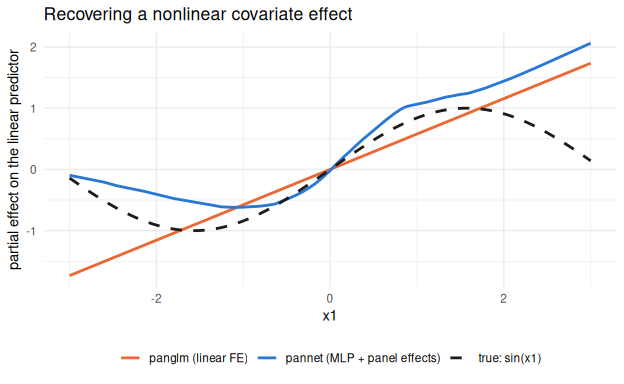

# pannet

Neural regression for panel data: for when the covariate-response
relationship is genuinely nonlinear. Classical panel estimators (`plm`,
`pglm`, [`panglm`](https://github.com/ielbadisy/panglm)) are fast and
exact, but structurally assume a linear index `x'β`. `pannet` replaces
the linear index with an MLP, while keeping the additive learnable
individual/time effects a plain neural network would otherwise drop.

## Installation

``` r
# install.packages("remotes")
remotes::install_github("ielbadisy/pannet")
```

## What the linear index misses

``` r
library(pannet)
library(panglm)

set.seed(1)
N <- 60; Tt <- 10
d <- data.frame(id = rep(1:N, each = Tt), time = rep(1:Tt, N))
x1 <- rnorm(N * Tt); x2 <- rnorm(N * Tt); x3 <- rnorm(N * Tt)
a_i <- rep(rnorm(N, sd = 1), each = Tt); g_t <- rep(rnorm(Tt, sd = 0.5), N)
eta_true <- sin(x1) + 0.5 * x2^2 + x3 + a_i + g_t
d$x1 <- x1; d$x2 <- x2; d$x3 <- x3
d$y  <- eta_true + rnorm(N * Tt, sd = 1)

test_ids <- sample(1:N, 15)
train <- d[!d$id %in% test_ids, ]; test <- d[d$id %in% test_ids, ]
eta_test_true <- eta_true[d$id %in% test_ids]

f_panglm <- panglm(y ~ x1 + x2 + x3, data = train, index = c("id", "time"),
                    model = "within", family = "gaussian")
f_pannet <- pannet(y ~ x1 + x2 + x3, data = train, id = id, time = time,
                    family = "gaussian", model = "individual",
                    epochs = 300, verbose = FALSE, seed = 1)

pred_panglm <- as.matrix(test[c("x1", "x2", "x3")]) %*% coef(f_panglm)
pred_pannet <- predict(f_pannet, newdata = test)

c(panglm_rmse = sqrt(mean((eta_test_true - pred_panglm)^2)),
  pannet_rmse = sqrt(mean((eta_test_true - pred_pannet)^2)))
#> panglm_rmse pannet_rmse 
#>    1.689343    1.354839
```

`panglm`’s coefficient on `x1` is a single number; it cannot represent
`sin(x1)` no matter how precisely it’s estimated. Holding `x2`/`x3` at
their mean and varying `x1` shows what each model actually fits:

``` r
# f_pannet was fit with model = "individual" (no time effect), so
# predict() = MLP(x) + a_i[id]; net out that one individual's learned
# effect (via individual_effects(), not an approximation) to isolate the
# MLP's own curve in x1.
chosen_id <- train$id[[1]]
ai_hat    <- individual_effects(f_pannet)[as.character(chosen_id)]

grid <- data.frame(x1 = seq(-3, 3, length.out = 200), x2 = 0, x3 = 0,
                    id = chosen_id, time = train$time[[1]])
grid$true_curve   <- sin(grid$x1)
grid$panglm_curve <- coef(f_panglm)["x1"] * grid$x1
grid$pannet_curve <- as.numeric(predict(f_pannet, newdata = grid)) - ai_hat

curves <- rbind(
  data.frame(x1 = grid$x1, eta = grid$true_curve,   which = "true: sin(x1)"),
  data.frame(x1 = grid$x1, eta = grid$panglm_curve, which = "panglm (linear FE)"),
  data.frame(x1 = grid$x1, eta = grid$pannet_curve, which = "pannet (MLP + panel effects)")
)
ggplot2::ggplot(curves, ggplot2::aes(x1, eta, color = which, linetype = which)) +
  ggplot2::geom_line(linewidth = 1) +
  ggplot2::scale_color_manual(values = c(
    "true: sin(x1)" = "#1f1c17",
    "panglm (linear FE)" = "#eb6834",
    "pannet (MLP + panel effects)" = "#2a78d6"
  )) +
  ggplot2::scale_linetype_manual(values = c(
    "true: sin(x1)" = "dashed", "panglm (linear FE)" = "solid", "pannet (MLP + panel effects)" = "solid"
  )) +
  ggplot2::labs(title = "Recovering a nonlinear covariate effect",
                x = "x1", y = "partial effect on the linear predictor", color = NULL, linetype = NULL) +
  ggplot2::theme_minimal(base_size = 11) +
  ggplot2::theme(legend.position = "bottom")
```



`panglm`’s fit is, structurally, the best straight line through a curve;
`pannet`’s MLP traces the curve itself.

## Validated, not just claimed

Independently re-run across 5 simulated panels each (N=60, T=10,
held-out individuals), recovering the *true noiseless signal*, not just
fitting noisy data, for two nonlinear DGPs (see
`vignette("pannet-validation")` for the full per-seed tables and
reproduction code):

| Estimator                                                   | `sin(x1) + 0.5·x2² + x3` | `sin(2πx1)·cos(x2) + tanh(2x2) + exp(-x3²)` |
|-------------------------------------------------------------|--------------------------|---------------------------------------------|
| `panglm` (exact linear panel FE)                            | 1.579                    | 1.543                                       |
| `pannet` (MLP + panel effects)                              | **1.195** (24% lower)    | **1.283** (17% lower)                       |
| `mgcv::gam` + `s(id, bs="re")` (additive panel model, GAMM) | 1.117                    | 1.283                                       |

The fair *panel* comparator is a GAMM
(`s(x1) + s(x2) + x3 + s(id, bs="re")`), not a pooled GAM with no
individual effects. Measured against that, `pannet` ties it on the
harder DGP and trails it slightly on the easier one – an honest result,
not a win: `pannet`’s case is that it doesn’t require the functional
form to be specified in advance (and can represent interactions a purely
additive GAMM would need naming explicitly), not that it’s more accurate
than a correctly-specified additive alternative.

## Feature tour

``` r
fit <- pannet(y ~ x1 + x2 + x3, data = train, id = id, time = time,
              family = "gaussian", model = "twoway", epochs = 100, verbose = FALSE, seed = 1)
predict(fit, newdata = test)[1:5]
#> [1] 0.3894549 4.3380833 2.4361881 0.2046940 1.5371779
marginal_effects(fit, variable = "x1")
#>   variable marginal_effect    scale
#> 1       x1       0.5509567 response
```

| Function                                  | What it does                                                                                                                                                                                                                                      |
|-------------------------------------------|---------------------------------------------------------------------------------------------------------------------------------------------------------------------------------------------------------------------------------------------------|
| `pannet()`                                | Fit; `model` = `"pooled"`, `"individual"`, `"time"`, `"twoway"`, or `"dynamic"` (lagged outcome/covariates via `lags =`); `family` = `"gaussian"`, `"binomial"`, `"poisson"`, `"multiclass"`, `"fractional"`; `offset()` supported in the formula |
| `predict()`                               | Fitted values on the training panel or new individuals/periods                                                                                                                                                                                    |
| `pannet_forecast()`                       | Genuine recursive multi-step-ahead forecasting for `model = "dynamic"` fits (iterates forward, feeding each step’s forecast back in as the next lag)                                                                                              |
| `pannet_debias()`                         | Split-panel jackknife (Dhaene & Jochmans 2015) correction for the Nickell (1981) finite-T bias in `model = "dynamic"` fits                                                                                                                        |
| `marginal_effects()`                      | Average marginal effect of a covariate via finite differences                                                                                                                                                                                     |
| `individual_effects()` / `time_effects()` | Extract the learned additive `a_i` / `gamma_t` embeddings                                                                                                                                                                                         |
| `pannet_benchmark()`                      | Compares a `pannet` configuration grid against `plm`/`pglm`/`panglm` on the same panel                                                                                                                                                            |
| `pannet_simulate()`                       | Synthetic panels for linear/nonlinear/dynamic DGPs (used throughout the vignettes and this README)                                                                                                                                                |

## When to use pannet (and when not to)

**Use it when:** the covariate-response relationship is plausibly
nonlinear and you have a reasonable number of periods per unit. That’s
the one case validated above where it beats a linear panel estimator by
a meaningful, replicated margin.

**Reach for `panglm`/`plm`/`pglm` instead when:** the effect is
plausibly linear (they’re faster, exact, and more precisely estimated
there), the panel is short (T ≲ 10) and sparse/zero-inflated (a known
bias mode, not fixed by tuning, see the validation vignette), you need a
dynamic (lagged-outcome) *forecast* (a linear AR+FE benchmark currently
forecasts better at realistic panel lengths, though `pannet_debias()`
helps with the bias itself), or you need inference with a small true
effect on a single fit (marginal effects can vary seed-to-seed by more
than the effect itself, so refit across a few seeds).

## Learn more

- `vignette("pannet-introduction")`: API tour, model types, `offset()`,
  extractor compatibility by model.
- `vignette("pannet-validation")`: the benchmark above in full, plus the
  sparse-count, dynamic-panel, seed-stability, and
  multi-step-forecasting checks that shaped the guidance above.
- `NEWS.md`: what’s fixed, what’s still open.
